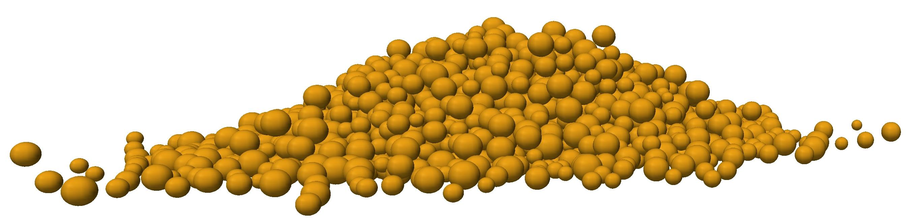
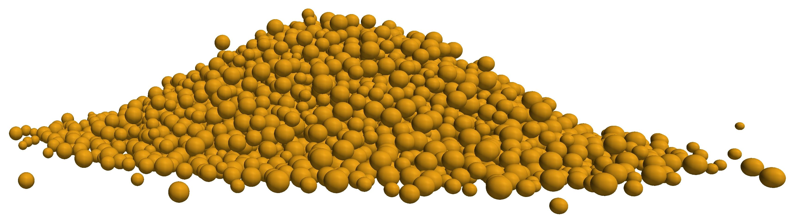
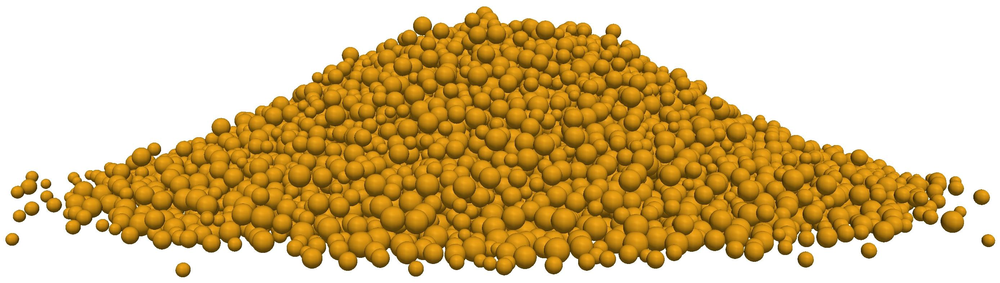
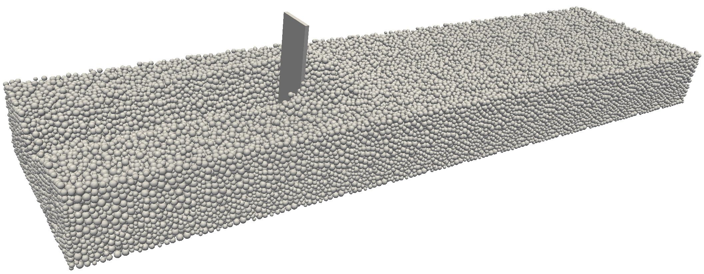

# Nonsmooth Granular Benchmarks

This repo contains the benchmarks used in 

> Kleinert, J. (2015) *Simulating Granular Material using Nonsmooth Time-Stepping and a Matrix-free Interior Point Method.* PhD thesis, Technische Universität Kaiserslautern

A free copy is available [here](https://www.bookshop.fraunhofer.de/buch/simulating-granular-material-using-nonsmooth-time-stepping-and-a-matrix-free-interior-point-method/244297).

The files are in VTK unstructured grid format. To visualize them using Paraview, create a Glyph of type `Sphere`, set the `Scale Factor` to 2 and choose `radius` as the `Scale Array`.

## Test Problem 1

A pile with 2048 spherical particles with out rotational degrees of freedom.

**File:** `particles2048pile.vtu`

| Parameter | Value |
| -- | -- |
| Bounds X | [0, 10] |
| Bounds Y | [0, 10] |
| Bounds Z | [0, 10] |
| gravity | 10 m/s^2 |
| frictional coefficient | 0.4 |
| Normal stiffness | 50 GPa |

The radii and masses of the particles are contained in the `.vtu` file.

## Test Problem 2

A pile with 5040 spherical particles with out rotational degrees of freedom.

**File:** `particles5040pile.vtu`

| Parameter | Value |
| -- | -- |
| Bounds X | [0, 10] |
| Bounds Y | [0, 10] |
| Bounds Z | [0, 10] |
| gravity | 10 m/s^2 |
| frictional coefficient | 0.4 |
| Normal stiffness | 50 GPa |

The radii and masses of the particles are contained in the `.vtu` file.

## Test Problem 3

A pile with 10192 spherical particles with out rotational degrees of freedom.

**File:** `particles10192pile.vtu`

| Parameter | Value |
| -- | -- |
| Bounds X | [0, 10] |
| Bounds Y | [0, 10] |
| Bounds Z | [0, 10] |
| gravity | 10 m/s^2 |
| frictional coefficient | 0.4 |
| Normal stiffness | 50 GPa |

The radii and masses of the particles are contained in the `.vtu` file.

## Test Problem 4

A trench filled with 105144 spherical particles with out rotational degrees of freedom. A rectangular blade is driven through the material at a depth of 0.2m and a constant velocity of 0.2 m/s.

**File:** `trench_settle.vtu`

| Parameter | Value |
| -- | -- |
| Bounds X | [0, 4] |
| Bounds Y | [0, 1] |
| Bounds Z | [0, 1] |
| gravity | 10 m/s^2 |
| frictional coefficient | 0.25 |
| Normal stiffness | 50 GPa |
| blade initial position | (-0.01, 0.5, 0.45) |
| blade constant velocity | (0.2, 0, 0) m/s |

The radii and masses of the particles are contained in the `.vtu` file.